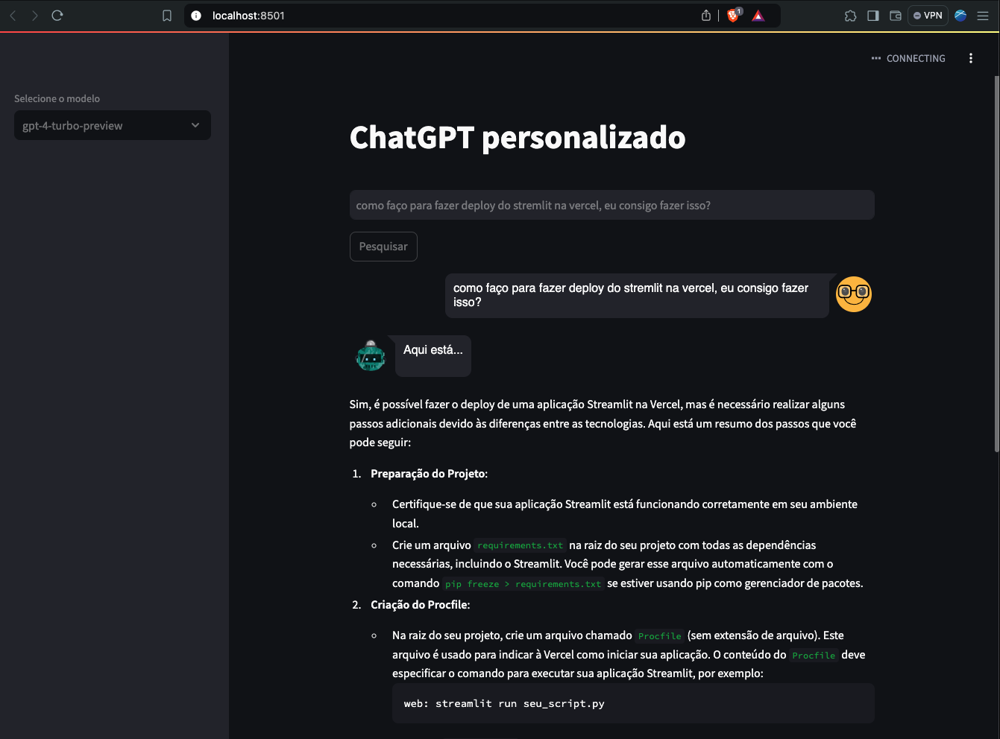

## ChatDev Personal with Embeddings

ChatDev is an intelligent assistant designed to help developers get accurate and contextual answers to their technical questions. Using embeddings, ChatDev improves the accuracy of answers by retrieving relevant information from a pre-indexed database, ensuring that answers are always aligned with the context of the question.

## Main Features

Improved Accuracy with Embeddings: ChatDev uses embeddings to search for semantically relevant information, ensuring that responses are highly accurate and contextualized.

Improved Accuracy with Embeddings: ChatDev uses embeddings to search for semantically relevant information, ensuring that responses are highly accurate and contextualized.

Semantic Search: Embeddings are used to search for relevant information in a vector database.

</br>
<p align="center">
  <kbd>
  
  </kbd>
  </br>
</p>
</br>


### ⌨ Technologies used

-   [langchain_openai](https://python.langchain.com/v0.2/docs/integrations/platforms/openai/) - version 0.1.16
-   [langchain_experimental](https://pypi.org/project/langchain-experimental/) - version 0.0.62
-   [langchain](https://www.langchain.com/ ) - version 0.2.7
-   [openai](https://pypi.org/project/openai/) - version 1.35.13
-   [streamlit](https://streamlit.io/) - version 1.36.0
-   [Pinecone](https://www.pinecone.io/) - version 4.1.2
-   [PyYAML](https://pypi.org/project/PyYAML/) - version 6.0.1
 

### ⌨ Installation
To use it, you need to clone the repository, install the dependencies and run the project. You also need to create a .yaml file and add your OPENAI_API_KEY and PINECONE_API_KEY key.

If you have any questions, access [Open AI](https://platform.openai.com/docs/guides/text-generation) and [Pinecone](https://www.pinecone.io/).

```bash
# Open terminal/cmd and then clone this repository
$ git clone https://github.com/JuanCampbsi/chatdev-personal.git

# Access the project folder in the terminal/cmd
$ cd chatdev-personal

# Create a virtual environment
$ pip install virtualenv

# Active your virtual environment
$ source venv/bin/activate

# Install the necessary tools
$ pip install -r requirements.txt

# Run the command in the terminal
$ streamlit run app.py                               

```

👨‍💻 **Author -  Software Developer ** 💻


[](https://www.linkedin.com/in/juancampos-ferreira/) 


